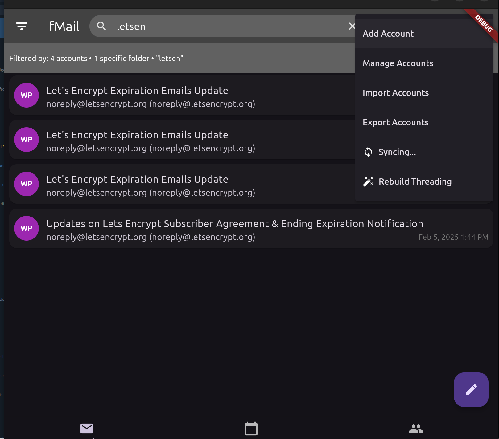
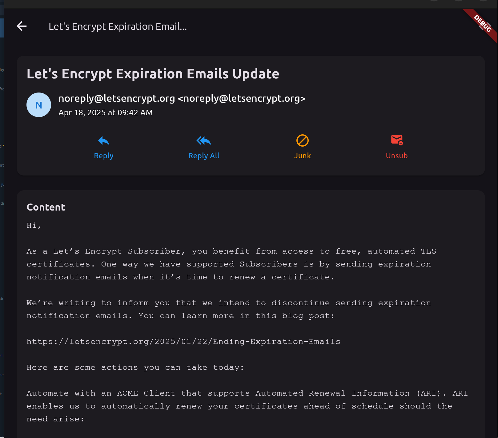
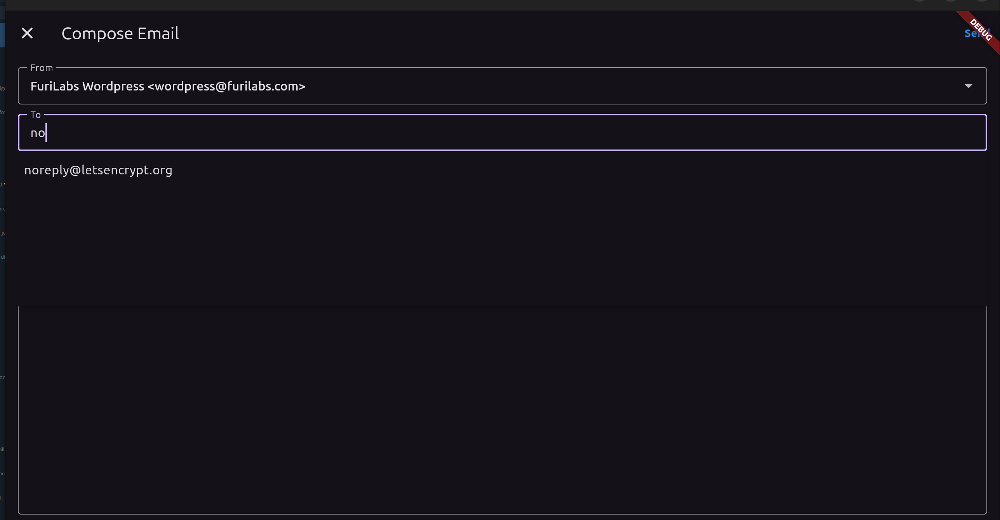
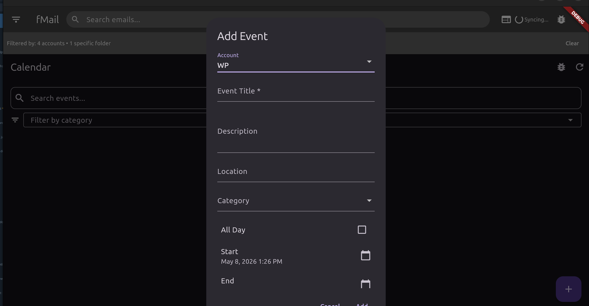
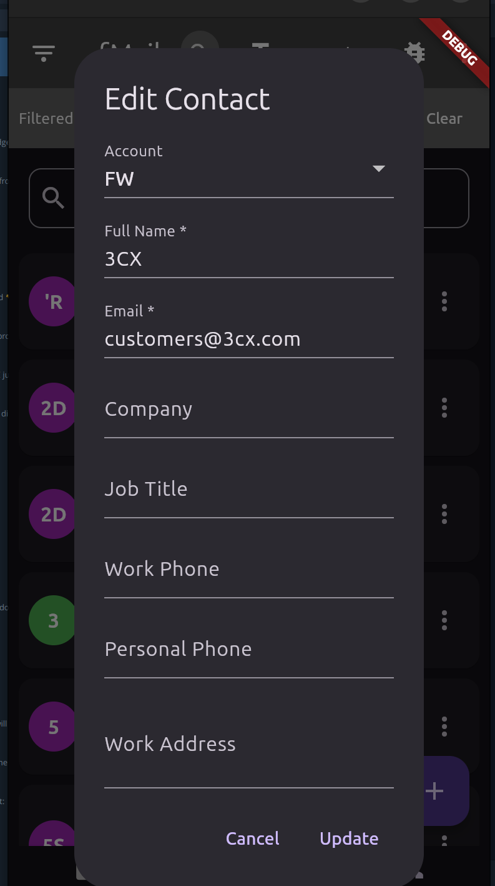

# fMail

A cross-platform, responsive, email client built with Flutter for [Furi Labs](https://furilabs.com). Designed primarily for Linux (including the Furi FLX series arm64 phones), with Android and iOS support.

---

## Table of Contents

- [Features](#features)
- [Screenshots](#screenshots)
- [Target Platforms](#target-platforms)
- [Prerequisites](#prerequisites)
- [Development Setup](#development-setup)
  - [Linux setup](#linux-setup-ubuntu--debian--furi-flx)
  - [Android setup](#android-setup)
  - [iOS setup](#ios-setup-macos-only)
  - [Web](#web-quickest--any-os)
- [Furi FLX Development Setup](#furi-flx-development-setup)
- [Build & Run](#build--run)
- [Account Configuration](#account-configuration)
- [CI / GitHub Actions](#ci--github-actions)
- [Backup, Restore & Moving Devices](#backup-restore--moving-devices)
- [Credential Storage](#credential-storage)
- [Database](#database)
- [Contributing & Development](#contributing--development)
- [License](#license)

---

## Features

- Multi-account IMAP email with per-account colour coding
- SMTP send, reply, and forward
- Full-text search across sender, subject, and body
- Email threading via `In-Reply-To` / `References` headers
- CalDAV calendar sync (Nextcloud, etc.)
- Contact address book with frequency-ranked autocomplete
- HTML email rendering
- Attachment support
- Secure credential storage (never written to SQLite)
- Import/export accounts via JSON
- Dark theme UI

---

## Screenshots







---

## Target Platforms

- **Linux desktop** (amd64) — `.deb` / binary
- **Furi FLX phone** (arm64 Linux) — `.deb`
- **Android** (arm64, x86_64) — `.apk`
- **iOS** (arm64) — `.ipa` (macOS build machine required)

> Flutter does not support cross-compilation for Linux. Build arm64 `.deb` on an arm64 machine (or Furi FLX phone directly).

---

## Prerequisites

### All platforms

- Flutter SDK (stable channel)
- Dart SDK (included with Flutter)

### Linux

```bash
sudo apt-get update
sudo apt-get install \
  libgtk-3-dev \
  libwebkit2gtk-4.0-dev \
  libsqlite3-dev \
  sqlite3 \
  ninja-build \
  cmake \
  clang \
  pkg-config
```

### Android

- Android Studio or Android SDK command-line tools
- A connected device or emulator

### iOS

- macOS with Xcode installed
- Apple Developer account for device builds

---

## Development Setup

This section walks through the full setup from zero to a running app for each platform.

### Verify Flutter is working

After installing Flutter, run:

```bash
flutter doctor
```

All required items for your target platform should show a green tick. Address any issues it reports before continuing.

---

### Linux setup (Ubuntu / Debian / Furi FLX)

1. Install Flutter:

   ```bash
   sudo snap install flutter --classic
   flutter sdk-path  # confirm install location
   ```

   Or install manually from [flutter.dev](https://flutter.dev/docs/get-started/install/linux).

2. Install system dependencies:

   ```bash
   sudo apt-get update
   sudo apt-get install \
     libgtk-3-dev \
     libwebkit2gtk-4.0-dev \
     libsqlite3-dev \
     libsecret-1-dev \
     sqlite3 \
     ninja-build \
     cmake \
     clang \
     pkg-config
   ```

3. Clone and run:

   ```bash
   git clone https://github.com/FuriLabs/fmail.experimental.git
   cd fmail.experimental
   flutter pub get
   flutter run -d linux
   ```

The app opens in a native Linux window. Import an account via Settings to start syncing email.

---

### Android setup

1. Install Flutter — as above, or via [flutter.dev](https://flutter.dev/docs/get-started/install/linux).

2. Install [Android Studio](https://developer.android.com/studio). During setup, install:
   - Android SDK
   - Android SDK Command-line Tools
   - Android Emulator (optional)

   Then accept SDK licenses:

   ```bash
   flutter doctor --android-licenses
   ```

3. Connect a device or start an emulator. Enable **Developer Options** and **USB Debugging** on your device, then connect via USB. Or launch an emulator from Android Studio's Device Manager.

4. Clone and run:

   ```bash
   git clone https://github.com/FuriLabs/fmail.experimental.git
   cd fmail.experimental
   flutter pub get
   flutter run -d android
   ```

---

### iOS setup (macOS only)

1. Install Flutter from [flutter.dev](https://flutter.dev/docs/get-started/install/macos).

2. Install Xcode from the Mac App Store, then:

   ```bash
   sudo xcode-select --switch /Applications/Xcode.app/Contents/Developer
   sudo xcodebuild -runFirstLaunch
   ```

3. Install CocoaPods:

   ```bash
   sudo gem install cocoapods
   ```

4. Clone and run:

   ```bash
   git clone https://github.com/FuriLabs/fmail.experimental.git
   cd fmail.experimental
   flutter pub get
   cd ios && pod install && cd ..
   flutter run -d ios
   ```

A physical device requires a free or paid Apple Developer account. Simulators work without one.

---

### Web (quickest — any OS)

No device or emulator needed. Works on any machine with Chrome installed:

```bash
git clone https://github.com/FuriLabs/fmail.experimental.git
cd fmail.experimental
flutter pub get
flutter run -d chrome
```

Full UI, SQLite, and IMAP sync all work locally in the browser. Ideal for fast UI iteration without a device.

---

## Furi FLX Development Setup

The [Furi FLX](https://furilabs.com) runs full Linux (arm64) — not Android. fMail is installed as a `.deb` package, the same as any Linux desktop.

### Building on the FLX directly

The simplest approach: clone and build on the phone itself.

```bash
# On the FLX phone (arm64 Linux)
sudo apt-get install libgtk-3-dev libwebkit2gtk-4.0-dev libsqlite3-dev \
  sqlite3 ninja-build cmake clang pkg-config

# Install Flutter (snap or manual)
sudo snap install flutter --classic

flutter pub get
flutter build linux --release
# Output: build/linux/arm64/release/bundle/
```

### Building via CI (recommended for releases)

The GitHub Actions workflow uses the free `ubuntu-24.04-arm` runner to build arm64 `.deb` packages automatically on every push. No FLX needed for CI builds — see the [CI section](#ci--github-actions) above.

### Cross-compilation

Flutter does **not** support Linux cross-compilation. You cannot build an arm64 binary from an amd64 machine. Options are:

- Build directly on the FLX or any arm64 Linux machine
- Use the GitHub Actions arm64 runner

### Android APK and 64-bit compliance

When building for Android, Flutter produces an `arm64-v8a` APK by default, which satisfies [Google Play's 64-bit requirement](https://developer.android.com/google/play/requirements/64-bit). No extra configuration is needed. If you also target x86 emulators, add `x86_64`:

```bash
flutter build apk --release --target-platform android-arm64,android-x64
```

Use an App Bundle for Play Store submission to minimise download size:

```bash
flutter build appbundle --release
```

---

## Build & Run

```bash
git clone https://github.com/FuriLabs/fmail.experimental.git
cd fmail.experimental
flutter pub get
```

### Run (development)

```bash
flutter run -d linux    # Linux desktop
flutter run -d android  # Android device/emulator
flutter run -d ios      # iOS device/simulator (macOS only)
```

### Fast cross-platform testing with Flutter Web

Flutter Web is the quickest way to iterate on UI without a device or emulator. Works on any OS with Chrome:

```bash
flutter run -d chrome
```

### Build release binary (Linux)

```bash
flutter build linux --release
# Output: build/linux/x64/release/bundle/  (amd64)
# Output: build/linux/arm64/release/bundle/ (arm64)
```

### Build APK (Android)

```bash
flutter build apk --release
# Output: build/app/outputs/flutter-apk/app-release.apk
```

### Package as .deb (Linux)

1. Install `flutter_distributor`:

   ```bash
   dart pub global activate flutter_distributor
   export PATH="$PATH:$HOME/.pub-cache/bin"
   ```

2. Build the package:

   ```bash
   flutter_distributor package --platform linux --targets deb
   # Output: dist/
   ```

   Architecture (`amd64` or `arm64`) is detected automatically from the build machine.

---

## Account Configuration

Accounts are imported/exported as JSON. See `fmail-accounts-example.json` for a template:

```json
{
  "accounts": [
    {
      "imap": "imap.example.com",
      "smtp": "smtp.example.com",
      "username": "user@example.com",
      "password": "your_password_here",
      "reply-from": "user@example.com",
      "name": "Your Name",
      "signature": "Regards,\nYour Name",
      "color": "#9C27B0",
      "display": "YN",
      "caldav-base-url": "https://caldav.example.com",
      "caldav-path": "/example.com/remote.php/dav/calendars/user/personal/"
    }
  ]
}
```

`caldav-base-url` and `caldav-path` are optional. Omit them if you don't use CalDAV.

---

## CI / GitHub Actions

The included workflow (`.github/workflows/build.yml`) builds `.deb` packages for both `amd64` and `arm64` automatically using **free GitHub-hosted runners** — no self-hosted setup required.

- **amd64**: `ubuntu-latest`
- **arm64**: `ubuntu-24.04-arm` (free for public repos)

**On push to `main`**: builds both `.deb` packages and uploads them as workflow artifacts.

**On version tag** (e.g. `v1.0.0`): additionally publishes both `.deb` files to a GitHub Release automatically.

To cut a release:

```bash
git tag v1.0.0
git push origin v1.0.0
```

To install a release `.deb`:

```bash
sudo apt install ./fmail-v1.0.0-linux-amd64.deb
```

Use `apt` (not `dpkg -i`) so that dependencies such as `zenity` and `libsqlite3-0` are resolved automatically.

---

## Backup, Restore & Moving Devices

> **Coming soon**: Settings → Export/Import will bundle everything into a single password-protected `.zip` — the easiest way to back up or move to a new device. The manual methods below work in the meantime.

fMail stores data in two places: a **SQLite database** (emails, contacts, calendar, settings) and the **system credential store** (passwords). A full backup requires both.

### Linux (including Furi FLX)

**Database** — one file:

```text
~/.dart_tool/sqflite_common_ffi/databases/furimail.db
```

Back it up by copying it:

```bash
cp ~/.dart_tool/sqflite_common_ffi/databases/furimail.db ~/furimail-backup.db
```

Restore (close fMail first):

```bash
cp ~/furimail-backup.db ~/.dart_tool/sqflite_common_ffi/databases/furimail.db
```

**Passwords** are stored in GNOME Keyring. Use the *Seahorse* GUI (*Passwords and Keys*) to view/export them, or the CLI:

```bash
secret-tool lookup account_<your@email.com>_password
```

**Moving to a new device**:

1. Export accounts from within fMail (Settings → Export Accounts) — saves a JSON file with all account details except passwords
2. Copy `furimail.db` to the new machine
3. Install fMail, import the accounts JSON — re-enters credentials into the new machine's keyring
4. Place `furimail.db` in the correct location — all emails, contacts, and calendar events are immediately available

---

### Android backup

App data lives in Android's protected storage. Back up via:

- **Google Backup** — enabled by default, backs up app data automatically to your Google account
- **ADB** (with developer mode enabled):

```bash
adb backup -f furimail-backup.ab com.furilabs.fmail
# Restore:
adb restore furimail-backup.ab
```

Passwords are stored in Android Keystore and included in encrypted device backups.

---

### iOS backup

- **iCloud Backup** — fMail data is included automatically
- **Finder / iTunes Backup** — full encrypted backup via cable includes app data and Keychain passwords
- **Manual file access** — connect in Finder → select device → Files tab → fMail → drag out the database file

> Use an **encrypted** backup when moving to a new iPhone — unencrypted backups do not include Keychain passwords.

---

## Credential Storage

Account passwords are **never written to SQLite**. They are stored via [`flutter_secure_storage`](https://pub.dev/packages/flutter_secure_storage), which delegates to the platform's native secure store:

- **Linux** — libsecret → GNOME Keyring (or any Secret Service-compatible store, e.g. KWallet)
- **Android** — EncryptedSharedPreferences (Android Keystore)
- **iOS** — Keychain
- **macOS** — Keychain

On Linux, `libsecret` must be available:

```bash
sudo apt-get install libsecret-1-dev
```

The Furi FLX ships with GNOME Keyring, so credentials work out of the box.

---

## Database

SQLite database at:

- **Linux**: `~/.dart_tool/sqflite_common_ffi/databases/furimail.db`
- **Android/iOS**: App internal storage

To reset and re-sync from IMAP:

```bash
rm ~/.dart_tool/sqflite_common_ffi/databases/furimail.db
```

---

## Contributing & Development

- [.claude/CLAUDE.md](.claude/CLAUDE.md) — Architecture reference for AI assistants and contributors: DB schema, key classes, sync algorithms, file structure, and coding patterns.
- [.claude/docs/TODO.md](.claude/docs/TODO.md) — Outstanding bugs, planned features, and known gotchas. Check here before starting work.

---

## License

MIT — see [LICENSE](LICENSE).
